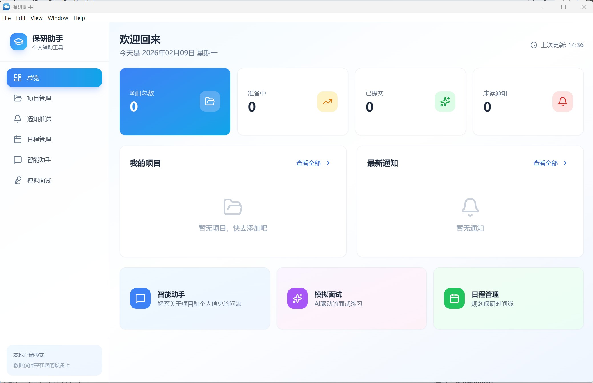

# 保研助手桌面版

<div align="center">

一款专为保研学生设计的全功能桌面辅助工具

[功能特性](#功能特性) • [快速开始](#快速开始) • [使用指南](#使用指南) • [技术栈](#技术栈)

</div>

---


## 📖 项目简介

保研助手是一款基于 Electron + React 开发的桌面应用，旨在帮助保研学生高效管理申请流程、材料和时间安排。所有数据本地存储，保护隐私安全。

## ✨ 功能特性

### 📊 总览仪表盘
- 一目了然查看所有项目进度
- 快速统计申请状态
- 即将到来的重要日程提醒

### 📁 项目管理
- 添加和管理多个保研项目
- 预设主流院校项目模板（清华、北大、复旦等）
- 项目状态追踪：准备中 → 已提交 → 面试中 → 已录取
- 记录项目关键信息（截止日期、官网链接、联系方式等）

### 📄 材料管理
- **10 大类材料分类**：
  - 成绩单、排名证明、英语证明
  - 推荐信、个人陈述、简历
  - 论文成果、实习实践、复习材料、其他
- 支持多种文件格式（PDF、Word、图片等）
- 文件上传、下载、删除功能
- 按项目分类管理材料

### 🔔 通知推送
- 自动监控项目官网更新
- 新通知实时推送提醒
- 一键跳转到官方网站
- 通知历史记录

### 🤖 智能助手
- AI 驱动的保研问答系统
- 保研流程咨询
- 项目信息查询
- 材料准备建议

### 🎤 模拟面试
- **综合面试**：考察综合素质和思维能力
- **专业面试**：针对专业知识深度提问
- **英语面试**：英语口语和表达能力训练
- 实时反馈和改进建议

### 📅 日程管理
- 周视图和列表视图切换
- 任务和里程碑管理
- 进度追踪和提醒
- 与项目关联的时间线

## 🚀 快速开始

### 环境要求

- **Node.js**: 18.0 或更高版本
- **npm**: 9.0 或更高版本

### 安装步骤

1. **克隆或下载项目**
   ```bash
   cd 保研助手桌面版（Demo）/app
   ```

2. **安装依赖**
   ```bash
   npm install
   ```

3. **启动应用**

   **方式一：使用启动脚本（推荐）**
   ```bash
   # Windows
   start.bat
   ```

   **方式二：手动启动**
   ```bash
   # 终端1：启动开发服务器
   npm run dev

   # 终端2：启动 Electron（等待上面的服务器启动后）
   npm run electron:dev
   ```

### 构建安装包

```bash
# Windows 安装包
npm run electron:build:win

# macOS 安装包
npm run electron:build:mac

# Linux 安装包
npm run electron:build:linux
```

构建完成后，安装包位于 `release/` 目录。

## 📖 使用指南

### 首次使用

1. **启动应用**：双击 `start.bat` 或使用命令行启动
2. **添加项目**：点击"项目管理"，选择预设模板或手动添加
3. **上传材料**：在项目详情页上传各类申请材料
4. **设置日程**：在日程管理中添加重要时间节点

### 核心功能使用

#### 添加保研项目
1. 进入"项目管理"页面
2. 点击"添加项目"
3. 选择预设模板或自定义填写
4. 填写项目信息（学校、专业、截止日期等）

#### 管理申请材料
1. 进入项目详情页
2. 选择材料类型
3. 点击"上传文件"
4. 支持拖拽上传或点击选择文件

#### 使用智能助手
1. 进入"智能助手"页面
2. 输入问题（如"保研需要准备哪些材料？"）
3. 获取 AI 生成的建议和答案

#### 模拟面试练习
1. 进入"模拟面试"页面
2. 选择面试类型（综合/专业/英语）
3. 开始面试，回答系统提问
4. 查看反馈和改进建议

## 🗂️ 项目结构

```
保研助手桌面版（Demo）/
├── app/                          # 应用主目录
│   ├── src/                      # 源代码
│   │   ├── components/           # React 组件
│   │   ├── pages/                # 页面组件
│   │   │   ├── Dashboard.tsx     # 总览页
│   │   │   ├── Projects.tsx      # 项目管理
│   │   │   ├── ProjectDetail.tsx # 项目详情
│   │   │   ├── Notifications.tsx # 通知推送
│   │   │   ├── Assistant.tsx     # 智能助手
│   │   │   ├── Interview.tsx     # 模拟面试
│   │   │   └── Schedule.tsx      # 日程管理
│   │   ├── db/                   # 数据库
│   │   │   └── database.ts       # IndexedDB 封装
│   │   ├── types/                # TypeScript 类型
│   │   └── utils/                # 工具函数
│   ├── dist-electron/            # Electron 主进程
│   │   ├── main.cjs              # 主进程入口
│   │   └── preload.cjs           # 预加载脚本
│   ├── build/                    # 应用图标
│   ├── package.json              # 项目配置
│   ├── vite.config.ts            # Vite 配置
│   └── start.bat                 # Windows 启动脚本
├── release/                      # 构建输出目录
├── BUILD_GUIDE.md                # 构建指南
└── README.md                     # 本文件
```

## 🛠️ 技术栈

| 技术 | 版本 | 用途 |
|------|------|------|
| React | 19.2 | 前端框架 |
| TypeScript | 5.9 | 类型安全 |
| Vite | 7.2 | 构建工具 |
| Electron | 28.0 | 桌面应用框架 |
| Tailwind CSS | 3.4 | 样式框架 |
| shadcn/ui | - | UI 组件库 |
| Dexie.js | 4.2 | IndexedDB 封装 |
| date-fns | 4.1 | 日期处理 |

## 💾 数据存储

- **存储方式**：IndexedDB（浏览器内嵌数据库）
- **数据位置**：本地设备，无需联网
- **隐私保护**：所有数据仅存储在用户设备上

**桌面端数据目录**：
- Windows: `C:\Users\<用户名>\.baoyan-helper`
- macOS: `~/.baoyan-helper`
- Linux: `~/.baoyan-helper`

## 🔧 常见问题

### Q: 安装依赖时速度很慢？
A: 使用国内镜像源：
```bash
npm config set registry https://registry.npmmirror.com
npm install
```

### Q: 启动时报错 "require is not defined"？
A: 已修复。确保 `dist-electron/` 目录下的文件是 `.cjs` 扩展名。

### Q: 构建时提示缺少 Python？
A: Electron 构建需要 Python 3.8+：
- Windows: 从 [python.org](https://www.python.org/) 下载安装
- macOS: `brew install python`
- Linux: `sudo apt install python3`

### Q: 如何清除应用数据？
A: 删除数据目录（见上方"数据存储"部分）或在浏览器开发者工具中清除 IndexedDB。

## 📝 开发说明

### 可用命令

```bash
# 开发
npm run dev              # 启动 Vite 开发服务器
npm run electron:dev     # 启动 Electron 应用

# 构建
npm run build            # 构建前端代码
npm run electron:build   # 构建所有平台安装包

# 代码检查
npm run lint             # ESLint 检查
```

### 修改注意事项

1. **主进程文件**：`dist-electron/main.cjs` 和 `preload.cjs` 必须使用 `.cjs` 扩展名
2. **路径别名**：使用 `@/` 引用 `src/` 目录
3. **样式**：使用 Tailwind CSS 类名

## 📄 许可证

MIT License

---

<div align="center">

**如有问题或建议，欢迎反馈！**

</div>
